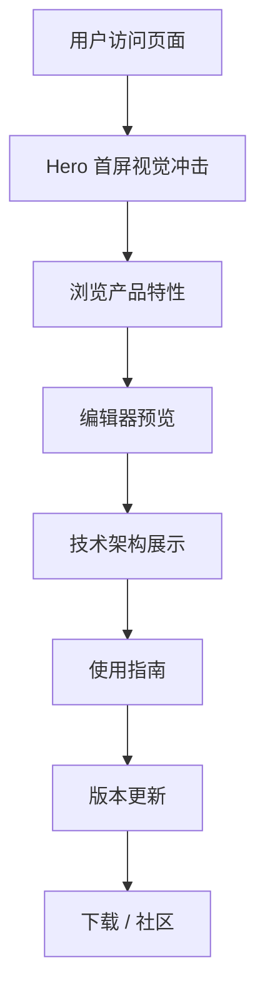

# RapidRAW 应用介绍页面 — 产品需求文档

## 1. 产品概述
RapidRAW 是一款美观、非破坏性、GPU 加速的 RAW 图像编辑器，定位为 Adobe Lightroom 的现代高性能替代品。本页面旨在以哈苏橙（Hasselblad Orange）为视觉核心，打造一个极致精美的应用介绍与使用指南落地页，向摄影爱好者和专业用户传达产品的高端、专业、极致体验感。

- 目标用户：摄影爱好者、专业摄影师、后期修图从业者、追求高性能工具的创作者
- 核心价值：以顶级视觉设计传递 RapidRAW 的轻量、高性能、跨平台、非破坏性编辑等产品亮点

## 2. 核心功能

### 2.1 页面模块
1. **首屏 Hero 区域**：全屏视觉冲击，产品名称、核心标语、CTA 下载按钮，配合哈苏橙渐变光效动画
2. **产品特性展示区**：GPU 加速、非破坏性编辑、跨平台支持、轻量 < 20MB 等核心卖点
3. **编辑器预览区**：RapidRAW 编辑器界面展示，模拟编辑工作流
4. **技术架构展示**：Rust + wgpu + React + Tauri 技术栈可视化
5. **使用指南区**：快速上手步骤指引，从安装到导出的完整流程
6. **版本更新区**：v1.8.13 更新日志展示
7. **下载与社区区**：多平台下载入口、Discord/Instagram 社区链接、GitHub 仓库

### 2.2 页面详情

| 页面区域 | 模块名称 | 功能描述 |
|---------|---------|---------|
| Hero 首屏 | 动态标题 | 产品名 + 核心标语，文字逐字显现动画，哈苏橙光晕背景 |
| Hero 首屏 | CTA 按钮 | 下载按钮，hover 时橙色脉冲扩散效果 |
| 产品特性 | 特性卡片 | 4 张玻璃态卡片，hover 时橙色边框光效 + 3D 倾斜 |
| 编辑器预览 | 界面展示 | 编辑器截图 + 浮动标注动画，展示核心编辑功能 |
| 技术架构 | 技术标签 | Rust/wgpu/React/Tauri 技术徽章，旋转悬浮动画 |
| 使用指南 | 步骤流程 | 4 步骤时间轴，滚动触发逐步显现 |
| 版本更新 | 更新日志 | v1.8.13 修复项列表，代码风格展示 |
| 下载社区 | 下载入口 | Windows/macOS/Linux/Android 四平台下载 |
| 下载社区 | 社区链接 | Discord/Instagram/Github 链接按钮 |

## 3. 核心流程

用户访问页面 → 被 Hero 区域视觉冲击吸引 → 向下滚动浏览产品特性 → 查看编辑器预览了解功能 → 阅读使用指南快速上手 → 点击下载按钮获取应用

## 4. 用户界面设计

### 4.1 设计风格
- **主色调**：哈苏橙 #CF4E24（Hasselblad 经典橙），辅以暗色系 #0A0A0A / #1A1A1A 背景
- **辅助色**：暖白 #FAFAF5、浅橙 #FF8C42、深橙 #9E3A12
- **按钮风格**：圆角胶囊型，哈苏橙渐变填充，hover 时光晕扩散 + 微缩放
- **字体方案**：
  - 标题：Playfair Display（优雅衬线体，摄影/艺术感）
  - 正文：DM Sans（现代几何无衬线，清晰可读）
  - 代码/技术：JetBrains Mono（技术感等宽字体）
- **布局风格**：深色全屏沉浸式，大留白 + 不对称构图，滚动叙事式
- **动画效果**：
  - 页面加载：文字逐字显现 + 哈苏橙光晕从中心扩散
  - 滚动触发：IntersectionObserver 驱动，元素从下方滑入 + 淡入
  - 特性卡片：hover 时 3D 透视倾斜 + 橙色边框光效
  - 背景层：缓慢流动的橙黑渐变 mesh + 细腻噪点纹理
  - 微交互：按钮 hover 脉冲、链接下划线动画、滚动进度条

### 4.2 页面设计概览

| 页面区域 | 模块名称 | UI 元素 |
|---------|---------|---------|
| Hero 首屏 | 动态标题 | Playfair Display 72px，文字 clip 橙色渐变，逐字淡入 |
| Hero 首屏 | 光晕背景 | 径向渐变橙黑 mesh，缓慢脉动动画 |
| Hero 首屏 | CTA 按钮 | 胶囊型，bg-gradient 橙色，hover scale + glow |
| 产品特性 | 特性卡片 | glassmorphism 卡片，backdrop-blur，橙色边框光效 |
| 编辑器预览 | 界面展示 | 深色圆角容器，内嵌截图，浮动标注动画 |
| 使用指南 | 步骤时间轴 | 垂直时间轴，橙色节点，滚动逐步显现 |
| 下载社区 | 平台按钮 | 方形图标 + 平台名，hover 橙色背景渐显 |

### 4.3 响应式设计
- 桌面优先（1440px 基准）
- 平板适配（768px）：卡片改为双列，时间轴左侧对齐
- 移动端适配（375px）：单列堆叠，字号缩小，触摸优化按钮尺寸

### 4.4 动效设计要点
- 首屏：1.5s 文字逐字淡入 + 光晕从中心扩散
- 特性卡片：hover 时 transform: perspective(1000px) rotateX/Y，box-shadow 橙色光晕
- 滚动：全局 IntersectionObserver，元素 translateY(40px) → translateY(0) + opacity 0→1
- 背景：CSS @keyframes 缓慢色相偏移，mesh gradient 流动
- 进度条：顶部固定 2px 橙色线条，随滚动位置变化
