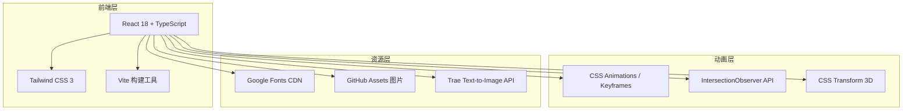

# RapidRAW 应用介绍页面 — 技术架构文档

## 1. 架构设计



## 2. 技术说明
- **前端**：React@18 + TypeScript + Tailwind CSS@3 + Vite
- **初始化工具**：vite-init (react-ts 模板)
- **后端**：无（纯前端静态页面）
- **数据库**：无
- **动画方案**：CSS Keyframes + IntersectionObserver，不引入额外动画库
- **字体**：Google Fonts CDN (Playfair Display, DM Sans, JetBrains Mono)
- **图片**：GitHub 仓库 Assets + Trae Text-to-Image API 生成装饰图

## 3. 路由定义

| 路由 | 用途 |
|------|------|
| / | 单页应用，所有内容通过滚动叙事呈现 |

## 4. 组件结构

```
src/
├── components/
│   ├── Hero.tsx          # 首屏 Hero 区域
│   ├── Features.tsx      # 产品特性卡片
│   ├── EditorPreview.tsx  # 编辑器预览展示
│   ├── TechStack.tsx     # 技术架构展示
│   ├── UserGuide.tsx     # 使用指南步骤
│   ├── Changelog.tsx     # 版本更新日志
│   ├── Download.tsx      # 下载与社区
│   ├── ScrollProgress.tsx # 滚动进度条
│   └── NoiseOverlay.tsx  # 噪点纹理覆盖层
├── pages/
│   └── Home.tsx          # 主页面组合所有组件
├── App.tsx
└── main.tsx
```

## 5. CSS 设计令牌

```css
:root {
  /* 哈苏橙色彩系统 */
  --hasselblad-orange: #CF4E24;
  --hasselblad-light: #FF8C42;
  --hasselblad-dark: #9E3A12;
  --hasselblad-glow: rgba(207, 78, 36, 0.4);

  /* 中性色系 */
  --bg-primary: #0A0A0A;
  --bg-secondary: #1A1A1A;
  --bg-card: rgba(26, 26, 26, 0.6);
  --text-primary: #FAFAF5;
  --text-secondary: #A0A0A0;

  /* 字体 */
  --font-display: 'Playfair Display', serif;
  --font-body: 'DM Sans', sans-serif;
  --font-mono: 'JetBrains Mono', monospace;
}
```

## 6. 动画规范

| 动画类型 | 实现方式 | 参数 |
|---------|---------|------|
| 文字逐字显现 | CSS @keyframes + animation-delay | opacity 0→1, translateY 20px→0, delay: 0.08s/字 |
| 光晕脉动 | CSS @keyframes | radial-gradient scale 1→1.2, opacity 0.6→0.3 |
| 滚动触发 | IntersectionObserver | threshold: 0.15, translateY 40px→0, opacity 0→1, duration 0.8s |
| 卡片 3D 倾斜 | onMouseMove + CSS transform | perspective 1000px, rotateX/Y ±5deg |
| 滚动进度条 | scroll event | width: scrollY / (docHeight - winHeight) * 100% |
| 噪点纹理 | CSS background-image | SVG noise filter, opacity 0.03 |
